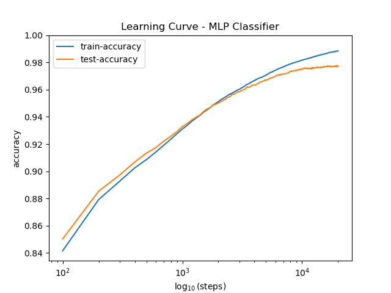

  

 

# Digit Recognition with Deep Learning

This project employs the techniques of Deep Learning to tackle a classic task 
in Artificial Intelligence: Optical Character Recognition (OCR). As a starting point, 
this project aims to construct a classifier for handwritten digits. 

The code implements an artificial neural network object, specifically a multilayer 
perceptron classifier. The object is equipped with the methods `fit` and `predict`
to train and test the model, like in other Machine Learning frameworks. Although 
many libraries already offer classifiers of this type, there is value in understanding 
the mathematics underlying these structures, as this allows for greater control of the network's
parameters and its learning process. 

## About the Training Set

As with any other classifier in Deep Learning, we need a vast database of existing 
examples to feed to the classifier. Luckily, training examples for this 
task can be found in the famous MNIST database, available [here](http://yann.lecun.com/exdb/mnist/). The 
database contains a training set with 60k images, and a testing set with 10k
images. Each image is in grayscale, is 28x28 pixels in size and is labeled with 
its corresponding digit from 0 to 9. 

## Results

An accuracy of 97.71% was achieved on the MNIST test set (10k examples) 
with a 3-layer MLP Classifier with 89 hidden neurons. The training process lasted 
for 20k steps at a constant learning rate of 0.1, where stochastic gradient descent was employed with 5% out of the 60k
training examples. These results are in line with the results of other classifiers 
employing a similar strategy.

  

> [!NOTE]
> Although ~98% is a good accuracy for a classic multilayer perceptron classifier, the
> state of the art classifiers reach accuracies above 99.77%. Convolutional neural networks are one of
> the preferred models for image recognition tasks like the one covered here. 
